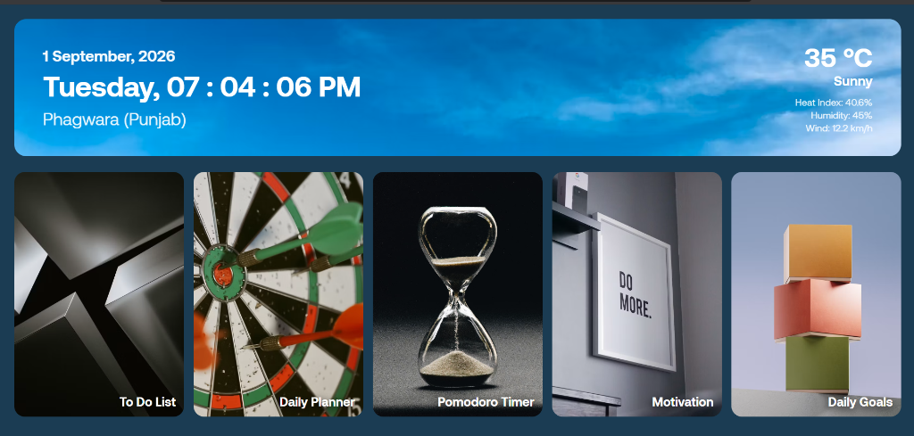
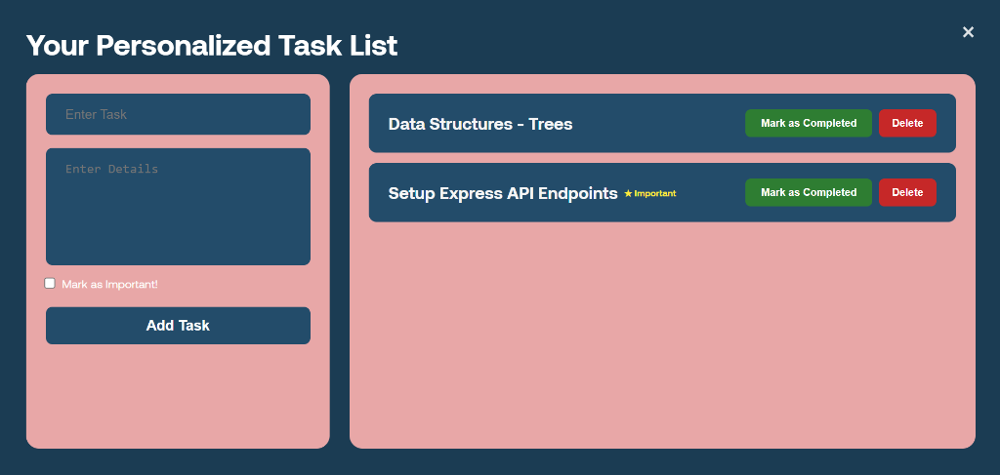
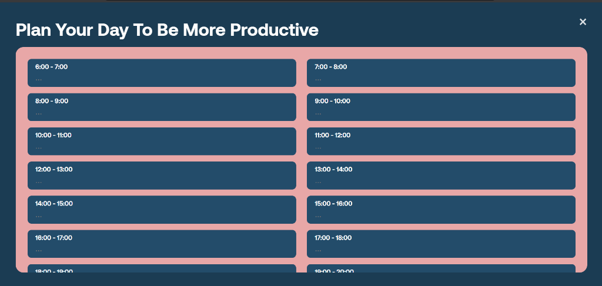
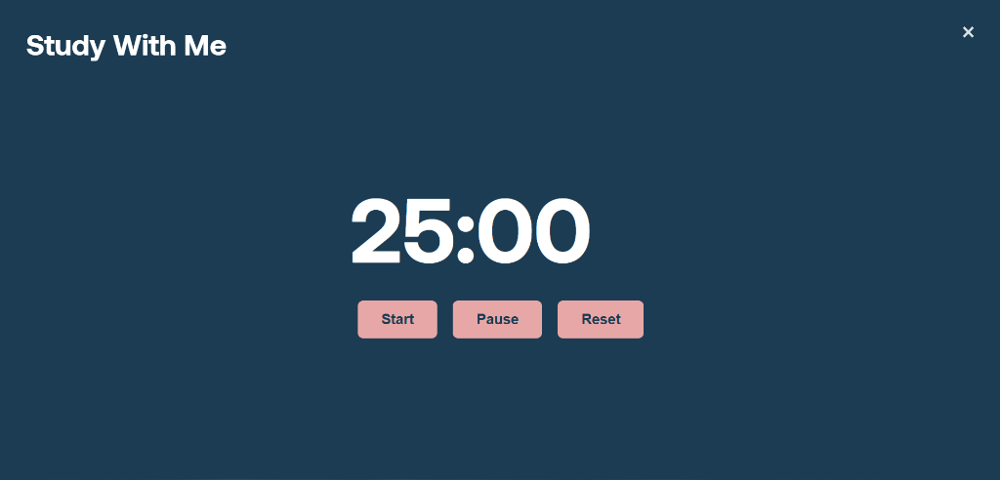

# Productivity Dashboard

A full-stack personal productivity app built with **React + Vite** (frontend) and **Express.js** (backend).
It features 5 interactive tools accessible from a single dashboard landing page.

---

## Screenshots

### Dashboard


### Feature 1 - To-Do List


### Feature 2 - Daily Planner


### Feature 3 - Pomodoro Timer


### Feature 4 - Motivation


---


## Tech Stack

| Layer    | Technology                        |
|----------|-----------------------------------|
| Frontend | React 18, Vite, React Router DOM  |
| Backend  | Express.js, Node.js               |
| Storage  | JSON file (`server/data/todos.json`) + localStorage |
| Styling  | Vanilla CSS, custom dark theme    |
| Font     | Aeonik                            |

---

## Running the Application Locally

### 1. Start the Express Backend (port 5000)
```bash
cd server
npm install
npm run dev
```

### 2. Start the React Frontend (port 3000)
```bash
cd client
npm install
npm run dev
```

The frontend proxies all `/api` calls to the backend automatically.

---

## Weather Bar and Live Clock (Header)

**File:** `client/src/components/Header.jsx`

Always visible at the top of the dashboard. Split into two sections:

### Left Side

| Element    | Description                                         |
|------------|-----------------------------------------------------|
| Date       | Displays today's date e.g. `1 September, 2026`     |
| Live Clock | Ticks every second e.g. `Tuesday, 06 : 25 : 33 PM` |
| Location   | Static label: `Phagwara (Punjab)`                   |

### Right Side (Weather)

| Element     | Description                                       |
|-------------|---------------------------------------------------|
| Temperature | Current temperature in C fetched from WeatherAPI  |
| Condition   | Weather condition text e.g. `Mostly Sunny`        |
| Heat Index  | Apparent temperature in percentage                |
| Humidity    | Current humidity percentage                       |
| Wind        | Wind speed in km/h                                |

### How it works

- **Clock**: A `setInterval` fires every 1000ms, reads `new Date()`, and formats it into a readable date and 12-hour time string. The interval is cleared when the component unmounts.
- **Weather**: On mount, a single `fetch` hits `https://api.weatherapi.com/v1/current.json` for Phagwara. If the request succeeds, state is updated with live data. If it fails, it falls back to hardcoded defaults (35 C, Sunny, 45% humidity, 12.2 km/h wind).

---

## Feature 1 - To-Do List

**File:** `client/src/pages/TodoListPage.jsx`  
**Route:** `/todos`  
**Backend API:** `http://localhost:5000/api/todos`

A full task manager that persists data to the Express backend stored in `server/data/todos.json`.

### Layout

| Left Column            | Right Column            |
|------------------------|-------------------------|
| Form to add a new task | List of all saved tasks |

### Form Fields

| Field             | Description                                             |
|-------------------|---------------------------------------------------------|
| Enter Task        | Required title of the task                              |
| Enter Details     | Optional description or notes                           |
| Mark as Important | Checkbox to flag a task as important (shown with star)  |
| Add Task button   | Submits the form and saves to backend                   |

### Task Cards

Each task card shows:
- Task title with an optional Important badge
- Mark as Completed button (turns grey when task is done)
- Delete button in red (permanently removes the task after confirmation)

### How it works

| Action            | What happens                                            |
|-------------------|---------------------------------------------------------|
| Page loads        | `GET /api/todos` fetches all saved tasks                |
| Add Task          | `POST /api/todos` creates a new task, prepended to list |
| Mark as Completed | `PUT /api/todos/:id` toggles the isCompleted flag       |
| Delete            | `DELETE /api/todos/:id` removes task from JSON file     |

---

## Feature 2 - Daily Planner

**File:** `client/src/components/DailyPlannerModal.jsx`  
**Storage:** `localStorage` with key `dayPlanData`

A day-planning grid covering 18 hourly time slots from 6:00 to 24:00.

### Layout

| Time Slot   | Input                              |
|-------------|------------------------------------|
| 6:00 - 7:00 | Text field for your plan           |
| 7:00 - 8:00 | Text field for your plan           |
| ...         | 18 total slots up to 23:00 - 24:00 |

### How it works

- On open, saved data is loaded from `localStorage` so your plan persists across refreshes.
- As you type into any slot, the value is immediately saved to `localStorage`. No save button needed.
- The 18 time slots are generated dynamically using `Array.from({ length: 18 })` starting at hour 6.

---

## Feature 3 - Pomodoro Timer

**File:** `client/src/components/PomodoroTimerModal.jsx`  
**Storage:** None - resets when the modal is closed.

A classic 25-minute focus timer based on the Pomodoro Technique.

### Controls

| Button | Action                                  |
|--------|-----------------------------------------|
| Start  | Begins the countdown from current value |
| Pause  | Freezes the timer without resetting     |
| Reset  | Stops timer and restores it to `25:00`  |

### How it works

- State `totalSeconds` starts at `25 * 60 = 1500`.
- When `isRunning` is true, a `setInterval` decrements `totalSeconds` by 1 every second.
- When `totalSeconds` reaches 0, the timer stops and shows: "Congrats on completing 25 minutes of study!"
- `formatTime()` converts raw seconds into MM:SS format using `Math.floor` and `padStart`.

---

## Feature 4 - Motivation

**File:** `client/src/components/MotivationModal.jsx`  
**Backend API:** `http://localhost:5000/api/motivation`

Displays a fresh random motivational quote every time the modal is opened.

### Display

- Blurred dark overlay background
- Centered quote card with quote text and author name e.g. `- Steve Jobs`
- "Loading..." shown while the quote is being fetched

### How it works

- Every time the modal opens, `useEffect` calls `fetchMotivationQuote()` from `services/api.js`.
- The API hits `GET /api/motivation?t=<timestamp>` — the timestamp prevents browser caching so a new quote is always returned.
- The Express server picks a random quote from a pool of 25+ curated quotes and returns `{ quote, author }`.
- If the server is unreachable, a hardcoded fallback quote is used.
- An `isMounted` flag prevents state updates if the modal is closed before the fetch completes.

---

## Feature 5 - Daily Goals Tracker

**File:** `client/src/components/DailyGoalsModal.jsx`  
**Storage:** `localStorage` with key `dailyGoals`

A personal checklist to set and track daily goals, with a live progress bar.

### Layout

| Section              | Description                                              |
|----------------------|----------------------------------------------------------|
| Title + Progress Bar | Shows X% Completed based on how many goals are checked   |
| Add Goal input       | Text field and Add Goal button                           |
| Goals List           | Each goal with a checkbox and a delete button            |

### Progress Bar

- Calculates: `(completedCount / totalGoals) * 100`
- Updates live as you check or uncheck goals
- Shows 0% when no goals exist, 100% when all are done

### How it works

| Action       | What happens                                              |
|--------------|-----------------------------------------------------------|
| Open modal   | Goals loaded from `localStorage` — persists across refreshes |
| Add Goal     | New goal `{ text, completed: false }` appended and saved  |
| Check goal   | `completed` flag toggled, progress bar updates instantly  |
| Delete (x)   | Goal removed by index, localStorage updated               |

---

## Project Structure

```
DashBoard/
├── client/                              # React + Vite frontend (port 3000)
│   └── src/
│       ├── components/
│       │   ├── Header.jsx               # Weather bar + live clock
│       │   ├── DailyPlannerModal.jsx    # Feature 2 - Daily Planner
│       │   ├── PomodoroTimerModal.jsx   # Feature 3 - Pomodoro Timer
│       │   ├── MotivationModal.jsx      # Feature 4 - Motivation quotes
│       │   └── DailyGoalsModal.jsx      # Feature 5 - Daily Goals Tracker
│       ├── pages/
│       │   ├── DashboardLandingPage.jsx # Landing page with 5 feature cards
│       │   └── TodoListPage.jsx         # Feature 1 - To-Do List
│       └── services/
│           └── api.js                   # All backend API call helpers
│
└── server/                              # Express.js backend (port 5000)
    ├── server.js                        # Main server + /api/motivation endpoint
    ├── routes/
    │   └── todoRoutes.js                # CRUD routes for /api/todos
    ├── utils/
    │   └── storage.js                   # Read/write helpers for todos.json
    └── data/
        └── todos.json                   # Persistent task storage
```
